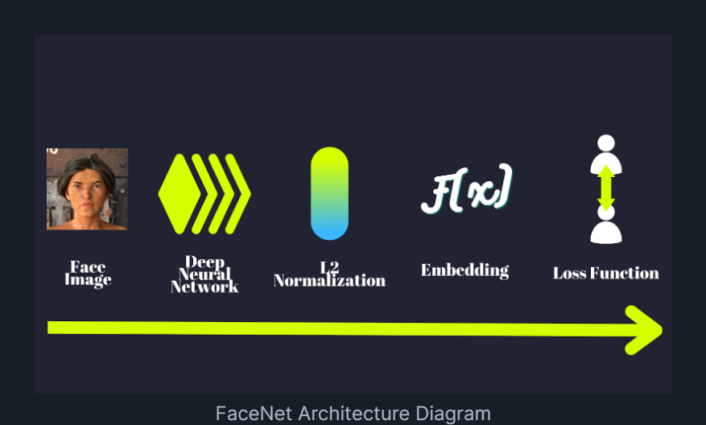
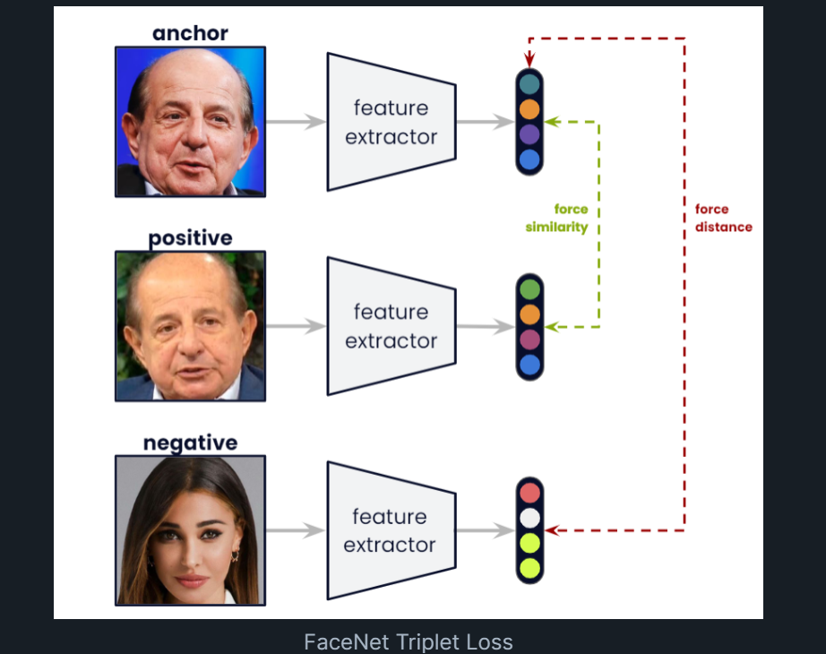

# Face Recognition: Facenet and MTCNN

The "Custom Face Recognition Model Using FaceNet" project leverages cutting-edge technologies such as FaceNet, MTCNN (Multi-task Cascaded Convolutional Neural Network), OpenCV, and scikit-learn to develop a robust and efficient facial recognition system.

## Screenshots

## Concepts

#### FaceNet:
- Facenet is a state-of-the-art deep learning model for face recognition developed by Google researchers. It utilizes a deep convolutional neural network (CNN) architecture to extract high-quality feature embeddings from facial images. These embeddings encode unique characteristics of each face in a compact vector space, enabling efficient comparison and recognition of faces. Facenet's groundbreaking approach to face recognition achieves remarkable accuracy and robustness across various datasets and challenging conditions, making it an ideal choice for building advanced facial recognition systems.

#### MTCNN (Multi-task Cascaded Convolutional Neural Network):
- MTCNN is a deep learning-based face detection and alignment algorithm that plays a crucial role in preprocessing facial images for recognition tasks. It consists of three stages: face detection, facial landmark localization, and alignment. MTCNN accurately detects and localizes faces in images while simultaneously estimating facial landmarks such as the eyes, nose, and mouth. This precise alignment ensures that facial images are correctly positioned and standardized before being fed into the FaceNet model for feature extraction and recognition. By integrating MTCNN into the pipeline, the custom face recognition model achieves superior performance in detecting and processing facial regions, enhancing the overall accuracy and reliability of the system.

